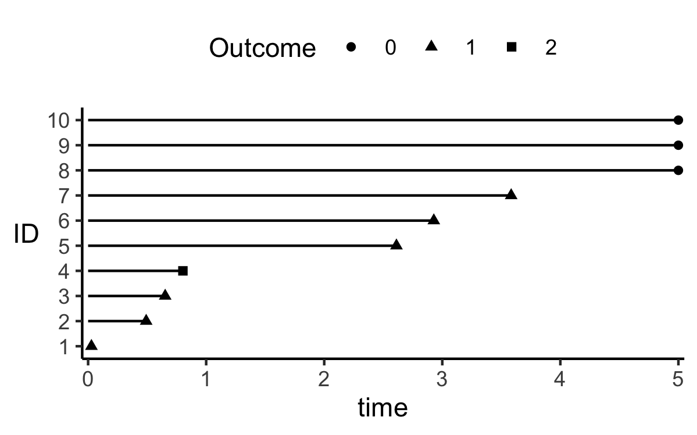
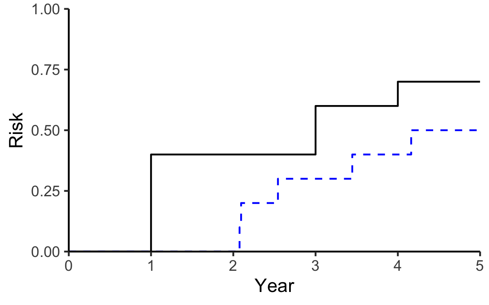
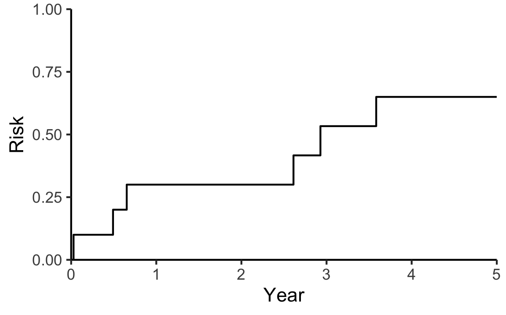

```{r setup, include=FALSE}
library(knitr)
library(formatR)
opts_chunk$set(tidy.opts=list(width.cutoff=60),tidy=TRUE)

packages <- c( "data.table","tidyverse","ggplot2","ggExtra","formatR",
               "gridExtra","skimr","here","RColorBrewer","survival")

for (package in packages) {
  if (!require(package, character.only=T, quietly=T)) {
    install.packages(package, repos='http://lib.stat.cmu.edu/R/CRAN')
  }
}

for (package in packages) {
  library(package, character.only=T)
}

remotes::install_github("rstudio/fontawesome")

library(fontawesome)

thm <- theme_classic() +
  theme(
    legend.position = "top",
    legend.background = element_rect(fill = "transparent", colour = NA),
    legend.key = element_rect(fill = "transparent", colour = NA)
  )
theme_set(thm)
```

\newpage
\onehalfspacing

# Cohort and Timescale

Most of the tools we use in epidemiology are either defined, or are demonstrably valid, only based upon the presence or absence of certain fundamentals or some foundation. The idea of a cohort, and a well defined timescale are two pillars of this foundation.^[For example, you should already know about how a case-control odds ratio can be used to estimate a *cohort* risk ratio, rate ratio, or odds ratio, depending on how the controls are sampled from the original cohort. That is, the interpretation of a case-control odds ratio depends on details emanating from the cohort we have. Specifically, a case-control odds ratio quantifies a cohort risk ratio, rate ratio, and odds ratio when we use base-case sampling, incidence density sampling, and cumulative sampling, respectively.]

In epidemiologic settings, a cohort is simply a group of people. Ideally, we would like to use a particular cohort to better understand features of the population from which this cohort was sampled. Cohorts can be either closed (people do not enter or leave the cohort during the study), or open (people are free to enter or leave the study at any time). In epidemiology (and particularly in this course) we deal mostly (exclusively) with closed cohorts. 

That we can interpret a parameter estimate for an exposure of interest from, say, a logistic regression model as a ratio of two odds depends on the fact that we've collected data on a *cohort* with a well-defined start and stop time. Without this underlying concept of a cohort with well-defined start and stop times, all we get from logistic models are values of a parameter which maximize the likelihood function, which is not the same as an odds or risk ratio.<!-- ^[Consider a fictional "Frankenstein" cohort of 600 men and 400 women, with 250 women aged 15-25, and the rest between 55-64 years. A subset of the cohort is recruited between 1910-1955, with the rest recruited between 2000-2010. We define an outcome indicator to be 1 if the individual experienced ovarian cancer, 0 otherwise. If we fit a logistic model regressing this outcome against, say, race and BMI, can we say that we are modeling the **risk** of ovarian cancer? No.] -->

To completely define a cohort, we need to clearly define a start or origin time, and a stop time. In the case of a closed cohort, without a well defined start and stop time, we would not be able to decisively state whether a given person should be in or has left the cohort. Consider the following diagram:

```{r, warning=F, message=F, echo=F, include=F}

cohort <- read_csv("../data/2021_12_30-section1_cohort.csv")

cohort %>% 
  filter(ID<=10) %>%
  mutate(ID=rank(stop,ties="random"),
         outcome=if_else(stop<5,"Event","No Event"),
         outcome=if_else(ID==4,"Withdraw",outcome)) %>% 
  ggplot(.) + 
  geom_linerange(aes(y=ID,xmin=start,xmax=stop)) +
  geom_point(aes(y=ID,x=stop,shape=factor(outcome))) +
  scale_y_continuous(expand=c(0.05,0.05), 
                     breaks=seq(1,10,1)) +
  scale_x_continuous(expand=c(0,0.05)) +
  scale_shape_manual(name = "Outcome",values = c(1, 17, 4)) +
  theme(axis.title.y = element_text(angle=0,vjust=.5))


ggsave("../figures/2021_08_19-figure1.png")

```

```{r tenobs, out.width="10cm", fig.align='center', fig.cap="Observed data from a hypothetical study of 10 observations. Data are from a closed cohort with a common start time (time=0) and up to 5 time-points (e.g., weeks, months, years) of follow-up.",echo=F}

```

Figure \ref{fig:tenobs} shows ten simulated observations. In this setting, time zero is our start time. The start time should correspond to some well-defined event such as an age of interest (age as time-scale), a date of interest (calendar date as time-scale), or the timing of some important study marker (e.g., date of randomization to treatment versus placebo).

Consider the following examples from the literature with different study time-scales:

1) @Naimi2021a use data from a randomized trial to estimate the adherence adjusted per protocol effect of daily low-dose aspirin on pregnancy outcomes in ~1,200 women. In this study, the timescale was **weeks since randomization**, and ranged from 0 to 60 weeks.

2) @Getahun2005 examined stillbirth, small for gestational age, and infant mortality occurrence by the racial classification of both parents (e.g., white-white, white-black, black-white, black-black) in roughly 20 million pregnancies in the United States. In this study, the timescale was **gestational age**, starting at the 20th week of gestation.

3) @Huang2018 looked at the relation between different post-operative management strategies, including the use of dexamethasone versus flurbiprofen axetil on survival in 588 patients undergoing surgical lung resection for non-small-cell lung cancer. In this study, the timescale was **time since surgical resection**.

4) @Schwarzinger2018 looked at the relation between alcohol use and dementia risk in nearly 31 million individuals in France between 2008 and 2013. In this analysis, the timescale was age, meaning that "time 0" was the age at which the individual entered into the study, corresponding to the **age at the calendar date during which the study started**.

```{r, warning=F, message=F, echo=F, include=F}

cens_dat <- read_csv("../data/cens_dat.csv")
trunc_dat <- read_csv("../data/trunc_dat.csv")

p1 <- cens_dat %>% 
  ggplot(.) + 
  geom_rect(aes(xmin=0, xmax=5, ymin=1, ymax=3),color="gray",alpha=.1) +
  geom_linerange(aes(y=ID,xmin=start,xmax=time,linetype=type)) +
  geom_point(aes(y=ID,x=time,shape=outcome),size=5) +
  scale_shape_manual(name="Outcome",
                     values=c("o", "<", ">")) +
  scale_linetype(guide = "none") +
  scale_y_continuous(expand=c(0.05,0.05), 
                     breaks=seq(1,3,1),
                     limits=c(1,3)) +
  scale_x_continuous(expand=c(0,0.05),limits=c(0,5)) +
  theme(axis.title.y = element_text(angle=0,vjust=.5)) +
  ggtitle("Censoring Types")

p2 <- trunc_dat %>% 
  ggplot(.) + 
  geom_rect(aes(xmin=0, xmax=5, ymin=4, ymax=6),color="gray",alpha=.1) +
  geom_linerange(aes(y=ID,xmin=start,xmax=time,linetype=type)) +
  geom_point(aes(y=ID,x=time,shape=outcome),size=5) +
  scale_shape_manual(name="Outcome",
                     values=c(".", "o", "<", ">")) +
  scale_linetype(guide = "none") +
  scale_y_continuous(expand=c(0.05,0.05), 
                     breaks=seq(4,6,1),
                     limits=c(4,6)) +
  scale_x_continuous(expand=c(0,0.05),limits=c(-3,8)) +
  theme(axis.title.y = element_text(angle=0,vjust=.5)) +
  ggtitle("Truncation Types")

g <- arrangeGrob(p2,p1,nrow=2)
ggsave(file="../figures/2021_11_23-figure2_cens_trunc.png",
       plot=g,
       width = 12,
       height = 20,
       units = c("cm"),
       dpi = 300)

```

5) @Sabia2019 looked at the association between cardiovascular health at age 50 and the risk of subsequent dementia in ~8,000 individuals enrolled in the Whitehall II study. In this analysis, the timescale was **calendar date**, with the starting date being the date of clinical examination at age 50.

# Censoring and Truncation

Figure \ref{fig:tenobs} is an important tool, particularly for exploratory data analysis. However, for now, we will generalize this figure to depict two key concepts: **censoring** and **truncation**. These concepts are illustrated in Figure \ref{fig:censtrunc}, showing a line diagram corresponding to Figure \ref{fig:tenobs}, but with six distinct scenarios.

```{r censtrunc, out.width="12cm", out.height="20cm", fig.fullwidth = TRUE, fig.align = "center", fig.cap="Six observations in a hypothetical study depicting censoring and truncation (left, right, and interval for both).",echo=F}
knitr::include_graphics("../figures/2021_11_23-figure2_cens_trunc.png")
```

The first three observations in Figure \ref{fig:censtrunc} depict right, left, and interval censoring, respectively. The last three observations depict right, left, and interval truncation.^[Interval censoring and interval truncation are often referred to as double censoring and double truncation.]

**Right Censoring** (ID = 1 in Figure \ref{fig:censtrunc}: occurs when an individual is enrolled in the study, but we don't know whether the individual has had an event of interest or not. This type of censoring often occurs because either an enrolled individual leaves the study (withdrawal), or the study ends (administrative censoring). This distinction is sometimes referred to as "Type I" versus "Type II" censoring. It is an important one, which will come up several times in the class. Right censoring is often said to be the most common type of censoring. Generally, when we use the word "censoring" in this class, we are referring to right censoring.

**Left Censoring** (ID = 2 in Figure \ref{fig:censtrunc}: occurs when an individual is enrolled in the study, and we know has experienced an event of interest (and we know which event it is), but we have no information on *when* the event occurred. I believe this to be the most common type of censoring, due to the fact that most often, we collect data on whether an event occurred or not during the course of our study, and not on the exact timing of events. Thus, outcomes in a typical cohort study that do not have information on the timing of events are left censored.

**Interval Censoring** (ID = 3 in Figure \ref{fig:censtrunc}: occurs when an individual is enrolled in the study, and we know has experienced an event of interest (and we know which event it is), but we only know that the event occurred in a bounded *interval*, with the bounds occurring after the study start date and before the study end date.

:::{.rmdnote data-latex="{tip}"}

__Technical Note__:

|               In survival (a.k.a. time-to-event) analysis, survival time is typically classified as either continuous or discrete time. Simply put, in a continuous time setting, the time to the events of interest are positive real numbers ($\mathbb{R}^+$), or a quantity that can be represented as an infinite decimal expansion. In contrast, in a discrete time setting, the time to the events of interest are typically positive integer values ($\mathbb{Z}^+$), or a whole non-decimal number. In survival analysis \emph{theory}, there are important distinctions between continuous and discrete time analyses. These distinctions are much less important for practical analyses of time-to-event data. For example, in a continuous time setting, one might have interval-censored data, since the exact timing of the event of interest might not be known. However, if the timescale of an analysis is (e.g.) week on study, and we know that the event happened in week $J$, this is typically enough for a discrete time analysis, and we would not have to censor the outcome.

:::

**Right Truncation** (ID = 4 in Figure \ref{fig:censtrunc}): occurs when an individual is NOT enrolled in the study because the event happened after a particular date. One example is in @Medley1987, who studied time from exposure to HIV contaminated blood or blood products and the development of AIDS. Data were collected retrospectively from individuals with confirmed AIDS diagnosis. The number of individuals who were exposed to HIV contaminated blood or blood products that had not yet developed AIDS was not known. In this study, only those individuals who developed AIDS by the time the study was enrolling could be identified for inclusion, which resulted in right truncated data.

:::{.rmdnote data-latex="{note}"}

__Study Note__:

|               You may have encountered various definitions of "retrospective" and "prospective" cohorts: retrospective = case-control, prospective = cohort; the investigator's perspective; and the exposure record in relation to the outcome. You may have also heard that retrospective studies are generally lower quality than prospective studies, with a range of reasons as to why. Two fundamental questions are: which of these study designs is more prone to left, right, and interval truncation?; How do the ideas of truncation and censoring relate to the quality of retrospective versus prospective studies?

:::


**Left Truncation** (ID = 5 in Figure \ref{fig:censtrunc}: occurs when an individual is NOT enrolled in the study because the event happened before a particular date. This type of truncation is common in studies of spontaneous abortion. For example, @Waller1998 examined the relation between prenatal exposure to trihalomethanes in drinking water (a by product of chlorination) and spontaneous abortion. Women were recruited from prenatal care clinics. However, spontaneous abortion tends to be more common early in pregnancy (and can often be confused with normal menstruation). Thus, it is likely that many spontaneous abortions were missed because they occurred before enrollment began, resulting in left truncated data.

**Interval Truncation** (ID = 6 in Figure \ref{fig:censtrunc}): occurs when an individual is NOT enrolled in the study because the event happened between two dates. Interval truncation occurs in studies of, for example, autopsy confirmed neurodegenerative diseases (ND). On the one hand, diagnosing ND is difficult, and studies tend to focus on the occurrence of disease in older populations. Thus, individuals who experience ND early tend not to be included in these studies. On the other hand, because autopsy confirmation is required for inclusion in the study, individuals who survive past the study start date are also not included. This example, as well as methods to address interval truncation, are discussed in @Rennert2018. 

There are some important takeaways from these definitions and examples: 

First, with censoring, the individuals are included in our study but we do not see when their events occur. With truncation, we do not see the individuals, and thus cannot include them in our study.^[Linguistically, we say that *individuals* are censored, but *data* are truncated.]

Second, it's important to connect the idea of censoring and truncation back to the idea of cohort and timescale, and our ability to validly interpret regression model parameters as risk differences, risk ratios, or odds ratios.^[Validity here depends on more than just the presence or absence of censoring and truncation. But appropriate handling of censoring and truncation are essential (i.e., necessary, but not sufficient).] Clearly, censoring and truncation matter because they determine whose outcome is observed or who is in cohort. Without carefully considering how to handle censored or truncated data, we can obtain biased (i.e., inconsistent) results.

# Risk (Functions)

Let's say we did a study of the effect of some exposure on an outcome of interest, which yielded the following dataset:

\newpage

```{r synthdat, echo=F, results="asis"}

cohort %>% 
  filter(ID<=10) %>%
  mutate(ID=rank(stop,ties="random"),
         start_time=start,
         stop_time=stop,
         outcome=if_else(stop<5,"Event","No Event"),
         outcome=if_else(ID==4,"Withdrawal",outcome)) %>% 
  arrange(ID) %>% 
  select(ID, exposure, confounder, start_time, stop_time, outcome) %>% 
  knitr::kable(., caption="Synthetic Data", digits = 2)

```

These are the same data displayed in Figure \ref{fig:tenobs}.

We are going to focus here on risk. Risk is a central parameter in cohort studies [@Cole2015], and is often specified as the "probability of an event during a specified period of time." [@Rothman2008]^[It's useful to separate the linguistic connotations of the word "risk" from its mathematical definition, which can sometimes lead to confusion. For example, one might define the "risk of live birth". Linguistically, "risk" connotes something bad, whereas in scenarios in reproductive epidemiology successful live birth is good. Here, we will be using the word "risk" in its strictly mathematical sense. In practice, I will often use "probability" instead of risk to avoid this potential dissonance.] For now, let's evaluate the risk without looking at the role that the exposure plays in influencing the outcome. This is akin to a "no intervention" or "no treatment" scenario, by which we mean that we want to compute the risk of the outcome that we actually observed--i.e., the risk under the natural settings in the study. Importantly, this is **not** the risk if everyone's exposure were set to zero. It's the risk that would be observed if we did nothing. This is sometimes referred to as the **natural course** risk [@Rudolph2021].

:::{.rmdnote data-latex="{tip}"}

__Technical Note__:

|               Often when we use the word "bias" in epidemiology, we actually mean "inconsistent" in the statistical sense. Technically, an estimator $\hat{\theta}$ is consistent if, for some arbitrarily small $\epsilon > 0$: $$\lim_{n \rightarrow \infty} P( | \hat{\theta} - \theta | > \epsilon ) = 0.$$ When epidemiologic bias is present (confounding, selection, information), the estimator will not converge to the truth no matter how large a sample we have. In contrast, we say that an estimator is biased (in finite samples) if: $$E(\hat{\theta} - \theta) \neq 0.$$ That is, we can have zero confounding (i.e., a consistent estimator), but still have a biased estimator because of how poorly it performs at using the data to estimate the effect at a given sample size. One example of this is the partial likelihood estimator used to quantify parameters of a Cox regression model (see Johnson1982). Usually, this statistical bias will disappear as the sample size increases.

:::

Mathematically, we define the risk of an outcome over follow-up as 

$$ F(t) = P(T \leq t) $$

This equation quantifies the probability (or risk) that the observed failure time $T$ is less than or equal to some arbitrary threshold $t$, where the threshold $t$ is defined over the domain of follow-up. $F(t)$ quantifies the probability of the event occurring at or before time $t$.

Relatedly, we could define survival as:

$$S(t) = 1 - F(t) = P(T>t)$$

The risk and survival functions are complements to one another. Both equations are a compact way of asking how risk (or survival) cumulates over time. $S(t)$ quantifies the probability of no events occurring until after time $t$.

The risk function^[ The cumulative risk function, or cumulative distribution function, i.e., CDF] is a fundamental function in epidemiologic analyses specificaly, and data science more generally, for several reasons:

1) It is the most complete summary available of a random variable of interest @Wasserman2004 (p21). Statistically speaking, there is no other function that provides more information about a random variable of interest.^[ In the context of this class, and most epidemiologic analyses, the random variable of interest will be a time-to-event outcome, but this need not be the case. One can define a CDF for any continuous random variable of interest.]

2) All other measures of effect or occurrence can be defined as a function of the CDF. The risk, rate, odds, and hazards, which are commonly used to analyse epidemiologic data, can all be derived from the CDF @Klein2005.

3) It is among the most intuitive measures of occurrence available. There is a lot of literature now on how poorly humans reason with quantitive or probabalistic summaries @Kahneman2011, @Gilovich2002, @Taleb2007. Measures such as the odds ratio or hazard ratio add an additional layer of complexity [@Hernan2010, @Greenland1987, @Kaufman2010, @Kaufman2010]. Thus, focusing on risk has benefits in terms of keeping things simple.

For these reasons, we focus on risk extensively in this course.

We can compute the cumulative risk function $F(t)$ in several ways. Consider the synthetic data in Table 1, but imagine that instead of "outcome = Withdrawal" for ID 4, they had "outcome = Event". If this were the case, one could simply compute the risk function by calculating the average number of events in the first, second, third, fourth, and fifth years on study.^[This **only** works in a simple setting where there is only a single event type, no censoring, and no left truncation. Because this is very unlikely the approach we are using here is only for demonstration.] The denominator for this risk is everyone in the sample. For example, using the ten observations from the synthetic data in Table \ref{tab:synthdat}, we have:

\begin{align*}
\text{Year 1: } & \sfrac{0}{10} = 0 \\
\text{Year 2: } & \sfrac{0}{10} + \sfrac{3}{10} = .3 \\
\text{Year 3: } & \sfrac{0}{10} + \sfrac{3}{10} + \sfrac{1}{10} = .4 \\
\text{Year 4: } & \sfrac{0}{10} + \sfrac{3}{10} + \sfrac{1}{10} + \sfrac{1}{10} = .5 \\
\text{Year 5: } & \sfrac{0}{10} + \sfrac{3}{10} + \sfrac{1}{10} + \sfrac{1}{10} + \sfrac{0}{10} = .5 \\
\end{align*}

This simple approach is sometimes referred to as the empirical distribution function (ECDF) estimator, but (again) doesn't usually work in survival data (because of censoring and truncation).

\newpage

If we plot these risks using a step-function with Year as the $x$-axis and risk as the $y$-axis, we might get the following:

```{r, warning=F, message=F, echo=F, include=F}

d1 <- tibble(Year=c(0,1,2,3,4,5), Risk=c(0,0,.3,.4,.5,.5))

surv_dat <- cohort %>% 
  filter(ID<=10) %>%
  mutate(ID=rank(stop,ties="random"),
         start_time=start,
         stop_time=stop,
         outcome=if_else(stop<5,1,0))

example_surv <- survival::survfit(Surv(time=start_time,time2=stop_time,event=outcome)~1,data=surv_dat)
d2 <- tibble(Year=c(0,example_surv$time),Risk=c(0,1-example_surv$surv))

ggplot() + 
  geom_step(data=d1,aes(x=Year,y=Risk),
            direction="hv") +
  geom_step(data=d2,aes(x=Year,y=Risk),
            direction="hv",color="blue",linetype=2) +
  scale_x_continuous(expand=c(0,0)) +
  scale_y_continuous(expand=c(0,0), limits=c(0,1))

ggsave("../figures/2021_11_24-CumincExample.png")

surv_dat <- surv_dat %>% mutate(outcome=if_else(ID==4,2,outcome))

```

```{r basiccuminc, out.width="6cm", fig.align="center", fig.cap="Basic cumulative distribution function (cumulative risk) for the synthetic data presented in Table 1. The risks in this Figure were obtained by computing basic risk quantities in each year as 'Number Events / Number At Risk', and is used only for illustrative purposes. In more realistic settings, alternative approches (which will be presented later) should be used. Blue dashed line is CDF estimated via Kaplan-Meier, discussed next.",echo=F}

```

The approach we just used to compute the cumulative distribution function above was used to simply illustrate the core idea behind the risk function $F(t)$. This is not the approach one would use in typical settings, because we often have to deal with issues such as right censoring and left truncation.

The next section will be about **how** to estimate the cumulative distribution function for a time-to-event outcome. We will be introduced to two different approaches, first the Kaplan-Meier estimator, and then later (when we cover competing risks) the cumulative incidence function estimator (from @Gray1988). We'll also discuss the factors that should lead you to decide choosing one or the other, and go over how to use them in the R programming language. 

It's important to note here that the KM and CIF estimators will estimate the same thing and yield the same results when there are no competing risks present. We will cover what competing risks are, and what happens to these estimators when competing risks are present subsequently.

# Kaplan-Meier Estimator

The first estimator is the Kaplan-Meier (KM) approach. This approach should be used in a setting where you have a single time-to-event outcome of interest (e.g., all cause mortality). It can also "handle" right censoring and left-truncation.

The KM estimator for the survival curve is the product, taken over the ordered set of distinct event times, of the complement of the number of events divided by the number at risk:

$$ \hat{S}(t) = \prod_{k \in t_k \leq t} (1 - d_k/n_k) $$
where $d_k$ is the number of events, and $n_k$ is the number at risk, both at time $k = t_k$ [@Cole2020]. Here, $n_k = \sum_{i = 1}^n I(t_k \leq T_i)$, which is the number of individuals in the risk-set at time $t_k$. Taking the complement of this estimator gives us a KM estimator for the cumulative distribution function.

To implement the KM estimator in R, we need to use the `survival` package, which includes the `Surv()` and the `survfit()` functions. We will use the data in Table \ref{fig:tenobs}, and we have to set up the data in so the `Surv()` and `survfit()` functions work as we want them to.

The key issue we need to address is the following: in Table \ref{fig:tenobs}, we use "Withdrawal" to denote Type I right censoring, and the "No Event" to denote Type II right censoring. However, the functions in `R` do not distinguish between Type I and Type II censoring. We need set all these observation's (ID = 4, 8, 9, 10) outcome to the same value. We'll pick the number "0":

```{r, warning=F, message=F}

install.packages("survival",repos='http://cran.us.r-project.org')
library(survival)

# modify the data: "surv_dat" was used to create table 1
surv_dat <- surv_dat %>% 
  mutate(outcome=if_else(outcome %in% c(0,2),0,outcome))

# examine
surv_dat %>% 
  select(ID,start_time,stop_time,outcome) %>% arrange(ID)

# fit KM curve
example_surv <- survfit(Surv(time=start_time,time2=stop_time,event=outcome)~1,data=surv_dat)

# create dataset for plotting
plot_dat <- tibble(Year=c(0,example_surv$time),Risk=c(0,1-example_surv$surv))

# examine dataset
plot_dat

# plot KM curve
km_plot <- ggplot() + 
  geom_step(data=plot_dat,aes(x=Year,y=Risk),
            direction="hv") +
  scale_x_continuous(expand=c(0,0)) +
  scale_y_continuous(expand=c(0,0), limits=c(0,1))

```

```{r, warning=F, message=F, echo=F, include=F}
ggsave("../figures/2021_12_06-KM_Example.png",
       plot=km_plot)
```
```{r KMcuminc, out.width="6cm", fig.align="center", fig.margin=TRUE, fig.cap="Cumulative distribution function obtained from the Kaplan-Meier estimator from the example data in Table 1.",echo=F}

```

The CDF curve generated by the above code is presented in Figure \ref{fig:KMcuminc} in the margin.

It's important to clarify here that left truncation and right censoring are so common in time-to-event analyses, that the `survfit` function in `R` handles them by default. The way these are handled is through the coding/selection of the start time (for left truncation) and the outcome (for censoring). 

When left truncation occurs, the start time for follow-up in the sample will differ across participants. Some may align with "time zero" (which could correspond to a certain age, calendar date, or other specific time), but participants will enter into the study after "time zero". This is a classic sign of left truncation, and to address it using `survfit` and `Surv`, one has to ensure that the `time` argument in the `Surv` function reflects the study entry time.

Similarly, for censored observations, one has to select a common value for the outcome for all participants who were censored.

```{r, eval=F}

surv_model <- survfit(Surv(time = entry_time, time2 = exit_time, event = outcome))

```


:::{.rmdnote data-latex="{tip}"}

__Technical Note__:

|               Consider the Table (the `tibble`) in the R output above that includes the Year and the Risk plotted in the margin figure. Notice that the last number is `r round(1-last(example_surv$surv),2)`, effectively stating that the overall risk in the sample of 10 observations is `r round(1-last(example_surv$surv),2)`. But, out of the 10 individuals, only `r sum(surv_dat$outcome)` of them had the event (out of `r nrow(surv_dat)`). This suggests that the overall risk should be `r sum(surv_dat$outcome)/nrow(surv_dat)`, and not `r round(1-last(example_surv$surv),2)`. Why the discrepancy? Is the KM estimator wrong?

The explanation for this higher than expected risk is the censored observation (ID=4), and the fact that, built into the KM estimator is the "redistribution to the right" algorithm. This algorithm spreads the risk that would have resulted from any censored observations had they not been censored, and redistributes it proportionally to the events that occur after the censoring for this observation takes place. In effect, this algorithm redistributes the risk from censored observations to remaining observations. As a result, the end of study risk estimated with a KM estimator is usually higher in the presence of censoring than the empirical risk function.

A similar phenomenon occurs for left truncation. In effect, the "extended" KM estimator imputes the risks for the "ghosts" that were truncated, on the basis of the observed but delayed entries into the cohort. 

Both the re-distribution of censored risks and imputing of ghost risks is a "hidden imputation" that is not often recognized with the KM estimator @Cole2020. Redistribution-to-the-right has particularly important implications when competing risks are present.

:::

# Competing Events

Thus far we've discussed estimating risk under the unique and relatively uncommon scenario where there are only two possible events that can occur in the study: 1) the single event of interest, and 2) right censoring (either due to loss-to-follow-up or administrative censoring). 

This scenario is uncommon because in a typical study, there are several events that occur. For example, when studying cause specific death (e.g., death due to myocardial infarction), it is likely that death from other causes occurs in the sample. When studying preterm birth, it is likely that fetal loss (either due to early pregnancy loss, or stillbirth) occurs in the sample. When studying time to relapse among patients undergoing bone marrow transplants for leukemia, death^[There is a common theme: death is often an important competing event.] from any causes is possible.

When multiple events can occur in a study, the possibility of competing events (or competing risks) arises. **A competing event (or risk) is an event whose occurrence precludes the event of interest from occuring.**

When competing events are possible, one needs to more carefully evaluate exactly what the risk function is quantifying. The fundamental question one must ask is: "what should I do with the events that aren't of primary interest?" One approach, which is the simplest, is to create a **composite endpoint**. Composite endpoints can be created by coding *any* event as an "Event" with a KM or other estimator, even though the research question may be focused on a single component of the composite endpoint.

Unfortunately, while easy, creating composite endpoints to deal with competing events is often unsatisfying and potentially misleading. For example, if the exposure of interest has a large effect on a secondary endpoint, but a very small effect on the event of interest, the exposure effect on the event of interest would be overwhelmed by the effect that is not of primary interest.

To more appropriately handle competing events, we need to introduce two different *versions of risk*. The first is **cause-specific** risk. This is the risk we'd obtain if we prevented competing risks from occurring.^[Be aware that while the language here sounds very much like we're using the potential outcomes framework, we're not. You may have learned of this risk as the "conditional risk" in EPI 545.] We can estimate this risk very simply by censoring the competing risks.

To explore how we obtain estimates of the cause-specific risk function, let's use the cohort dataset (`2021_12_30-section1_cohort.csv`). This dataset has 100 observations and six variables.

```{r}
dim(cohort)
```

Here are the first six observations from the dataset:

```{r}
head(cohort)
```

Notice that the outcome has three different levels:

```{r}
cohort %>% count(outcome)
```

## Cause Specific Risk

Suppose we were primarily interested in the event labeled "outcome = 2", where "outcome = 1" denotes a competing risk, and "outcome = 0" denotes right censoring. To estimate the cause specific risk function for "outcome = 2", we can again use the KM estimator. What needs to be different this time around is that we have to treat as censored those with both "outcome = 0" as well as "outcome = 1". We can do this by creating an indicator^[Note that generally, the *indicator function* refers to a function that takes the value of 1 if the argument of the function is true, and zero otherwise. The function is usually denoted with an "$I()$" or a "$\mathbf{1}()$". In our case, if our outcome was denoted $Y$, the indicator variable we need to estimate the cause specific risk is $I(Y = 2)$ or $\mathbf{1}(Y = 2)$. In `R`, the `as.numeric()` function can serve as an indicator function.] variable for the outcome: 

```{r}

# note this is a numeric variable!
cohort <- cohort %>% mutate(cs_outcome = as.numeric(outcome==1)) 

```

This new variable converts all events (i.e., censoring and competing events) to censored observations:

```{r}
cohort %>% count(cs_outcome)
```

And we can use this with the KM estimator to obtain an estimate of the cause-specific risk function:

```{r}
surv_model <- survfit(Surv(time=stop, event=cs_outcome) ~ 1, data=cohort)

plot_dat <- tibble(time=surv_model$time,risk=1-surv_model$surv)

plot1 <- ggplot(plot_dat) + 
  scale_y_continuous(expand=c(0,0), limits=c(0,1)) + 
  scale_x_continuous(expand=c(0,0)) + 
  ylab("Cumulative Risk") +
  xlab("Time on Study") +
  geom_step(aes(x=time,y=risk))

ggsave(filename = "../figures/2021_12_29-cum_risk_section1.pdf",
       plot=plot1)


plot_dat_km <- plot_dat
```

The above code generates the `surv_model` object, creates a plot using this object with `ggplot`, and saves it to the `figures` folder using `ggsave`. We can include the saved figure in our RMarkdown document using the following code:

````
```{r csfigure, out.width="10cm", fig.align='center', fig.cap="Cumulative cause-specific ...", echo=T}`r ''`
knitr::include_graphics("../figures/2021_12_29-cum_risk_section1.pdf")
```
````

which provides the following Figure:

```{r csfigure, out.width="10cm", fig.align='center', fig.cap="Cumulative cause-specific risk of the outcome in the example dataset for section 1 (outcome = 1).", echo=F}
knitr::include_graphics("../figures/2021_12_29-cum_risk_section1.pdf")
```

\newpage

One could also use the generic `plot()` function to obtain the KM curve. For example: `plot(surv_model)` (try it!). However, it is much easier to modify the figure and adapt it (e.g., to meet submission requirements) using ggplot.

It's important to understand precisely and exactly how to interpret the risk curve in Figure \ref{fig:csfigure}. First, we combined into a single category all individuals who were censored and who had the competing risk event (outcome = 2), and we treated this entire category as censored. Second, and perhaps more importantly, the Kaplan-Meier estimator imputes the risk of the outcome of interest for censored observations (see Technical Note above). As a result, one has to interpret the cumulative risk curve in Figure \ref{fig:csfigure} as the risk that would be observed in a situation where we were able to prevent `outcome = 2` from occurring, thus keeping these individuals at risk for `outcome = 1`.^[Note that the same is true for other methods that adjust or account for censoring, such as inverse probability of censoring weighting or imputation [e.g. ,@Cain2009 or @vanBurren2012].]

This subtle point (the imputation of `outcome = 1` risk for competing events) is a controversial topic, but is unfortunately not always recognized as an issue. To place this issue into some context, imagine that in our dataset of 100 observations, `outcome = 1` denotes individuals who experience a myocardial infarction, and `outcome = 2` denotes death from any cause. In this case, estimating the cause specific risk of myocardial infarction translates directly to estimating the risk of myocardial infarction in a world where we'd prevent death from any cause from occurring.^[Again, even though these sentences are fundamentally counterfactual in nature, these risks are not typically formulated using potential outcomes.] For this reason, estimating cause-specific risks in the presence of competing events is my least favored approach. 

## Sub-Distribution Risk

One alternative to cause-specific risks is **sub-distribution** risks.^[You may have learned of this as an "unconditional" risk in EPI545.] These risks are useful even if we are interested in a primary outcome, and we have several other "nuisance" outcomes to deal with. 

Suppose again our interest lies in the event labeled "outcome = 1", where "outcome = 2" is a competing risk, and "outcome = 0" is right censoring. To estimate the sub-distribution risk function for "outcome = 1", we can no longer use the KM estimator. There are several options available to us to estimate sub-distribution risks, including the Aalen-Johansen estimator or Gray's cumulative incidence function (CIF) estimator. 

We'll first fit the Aalen-Johansen estimator to quantify the sub-distribution risk function for both "outcome = 1" and "outcome = 2". The code to fit the Aalen-Johansen estimator in R is nearly identical to the code we used to fit the KM estimator. The key difference lies in how the outcome is coded. To fit the Aalen-Johansen estimator, the outcome variable must be of the proper **type** and must be in a specific **order**. For example:

```{r, warning=F, message=F}

cohort <- read_csv("../data/2021_12_30-section1_cohort.csv")

cohort

table(cohort$outcome)

cohort <- cohort %>% mutate(outcome = factor(outcome, 0:2, labels=c("censor", "event", "competing risk"))) # note converted to factor

table(cohort$outcome)

```

In the `2021_12_30-section1_cohort.csv` data, the outcome is coded as a numeric variable. In the above code, we convert this numeric variable to a factor variable. The conversion and ordering of this factor variable is accomplished using the `factor()` function in `R`. In the arguments of this function, we tell it to convert the "outcome" variable (argument 1), we tell it that the order of the levels are `0, 1, and 2` (argument 2, coded as `0:2` in R), and we tell it that the labels for this order are "censor", "event", and "competing risk". Importantly, the censoring level has to come first, but the "event" and "competing risk" levels can come in any order.^[This becomes relevant when there are several competing risks and/or events of interest.] Once the outcome is coded in this way, we can use the same code we used to fit the KM estimator to obtain the AJ estimator of the sub-distribution function:

```{r, warning=F, message=F, fig.show=F}

aj_fit <- survfit(Surv(time=stop,event=outcome) ~ 1, data=cohort)

plot_dat0 <- tibble(time=aj_fit$time,risk=aj_fit$pstate[,2])

plot_dat1 <- tibble(time=aj_fit$time,risk=aj_fit$pstate[,3])

p1 <- ggplot() +
  scale_y_continuous(expand=c(0,0), limits=c(0,1)) +
  scale_x_continuous(expand=c(0,0)) +
  ylab("Cumulative Risk") +
  xlab("Time on Study") +
  geom_step(data=plot_dat0,aes(x=time,y=risk)) +
  geom_step(data=plot_dat1,aes(x=time,y=risk),color="#D55E00") +
  geom_step(data=plot_dat_km,aes(x=time,y=risk), linetype=2)

ggsave(filename = "../figures/2021_12_29-subdist_risk_aj_section1.pdf",
       plot=p1)

```

Again, we can include the saved figure in our RMarkdown document using the following code:

````
```{r sdajfigure, out.width="10cm", fig.align='center', fig.cap="Cumulative sub-dist ...", echo=T}`r ''`
knitr::include_graphics("../figures/2021_12_29-subdist_risk_aj_section1.pdf")
```
````

Which provides the following Figure:

```{r sdajfigure, out.width="10cm", fig.align='center', fig.cap="Cumulative sub-distribution risks of the outcomes obtained from the Aalen-Johansen estimator in the example dataset for section 1. Black line represents outcome = 1. Orange line represents outcome = 2. Dashed line represents cumulative cause-specific risks obtained with the Kaplan-Meier Estimator.", echo=F}
knitr::include_graphics("../figures/2021_12_29-subdist_risk_section1.pdf")
```

Gray's CIF estimator is available in the `cmprsk` package in R. To fit this estimator to our data, we can use the following:

```{r, warning=F, message=F}

library(cmprsk)

cohort <- read_csv("../data/2021_12_30-section1_cohort.csv")

gray_cif <- cuminc(cohort$stop, cohort$outcome, cencode=0) # note outcome is back to numeric!

str(gray_cif)

```

As we can see from the `structure` command above, the `cuminc()` function provides two sets of information, each with a `time`, `est`, and `var` element. In this case, the `est` element is an estimate of the sub-distribution risk of the outcome. In the list indexed by `1 1`, `est` represents the risk of "outcome = 1". In the list indexed by `1 2`, `est` represents the risk of "outcome = 2". We can use these risks and the `time` element for each to plot the relevant cumulative incidence functions of interest:

```{r, warning=F, message=F, fig.show='hide'}

plot_dat1 <- tibble(time=gray_cif$`1 1`$time,
                   risk=gray_cif$`1 1`$est,
                   Outcome=1) # capital for legend purposes

plot_dat2 <- tibble(time=gray_cif$`1 2`$time,
                   risk=gray_cif$`1 2`$est,
                   Outcome=2)  # capital for legend purposes

plot_dat <- rbind(plot_dat1, plot_dat2)

plot_dat <- plot_dat %>% mutate(Outcome=factor(Outcome))  # convert to factor here for legend purposes

plot1 <- ggplot() + 
  scale_y_continuous(expand=c(0,0), limits=c(0,1)) + 
  scale_x_continuous(expand=c(0,0)) + 
  ylab("Cumulative Risk") +
  xlab("Time on Study") +
  scale_color_manual(values=c("#000000","#D55E00")) +
  geom_step(data=plot_dat,aes(x=time,y=risk,color=Outcome)) +
  geom_step(data=plot_dat_km,aes(x=time,y=risk), linetype=2)

ggsave(filename = "../figures/2021_12_29-subdist_risk_cif_section1.pdf",
       plot=plot1)
```

Again, we can include the saved figure in our RMarkdown document using the following code:

````
```{r sdciffigure, out.width="10cm", fig.align='center', fig.cap="Cumulative sub-dist ...", echo=T}`r ''`
knitr::include_graphics("../figures/2021_12_29-subdist_risk_section1.pdf")
```
````

Which provides the following Figure:

```{r sdciffigure, out.width="10cm", fig.align='center', fig.cap="Cumulative sub-distribution risks of the outcomes obtained from Gray's CIF estimator in the example dataset for section 1. Black line represents outcome = 1. Orange line represents outcome = 2. Dashed line represents cumulative cause-specific risks obtained with the Kaplan-Meier Estimator.", echo=F}
knitr::include_graphics("../figures/2021_12_29-subdist_risk_cif_section1.pdf")
```

\newpage

The key now is to clarify the interpretation of the sub-distribution risk in Figure \ref{fig:sdajfigure} or Figure \ref{fig:sdciffigure}, and the cause specific risk which is represented in both Figures with a dashed line. As we've already stated, the dashed line represents the cumulative risk of outcome = 1 we'd observe if we could prevent outcome = 2 from occurring. 

On the other hand, the sub-distribution quantifies the risk for outcome 1 if outcome 2 were allowed to occur naturally. The same interpretation is obtained if outcome 2 is the primary outcome of interest. Why is this called a sub-distribution? 

```{r, include=F}

library(zoo)

plot_dat1 <- tibble(time=round(gray_cif$`1 1`$time,1),
                   risk1=gray_cif$`1 1`$est) 

plot_dat2 <- tibble(time=round(gray_cif$`1 2`$time,1),
                   risk2=gray_cif$`1 2`$est) 

plot_dat <- left_join(plot_dat1,plot_dat2,by="time")

plot_dat <- plot_dat %>% na.locf(.)

plot1 <- ggplot() +
  scale_y_continuous(expand=c(0,0), limits=c(0,1)) +
  scale_x_continuous(expand=c(0,0)) +
  ylab("Cumulative Risk") +
  xlab("Time on Study") +
  theme_minimal() +
  geom_step(data=plot_dat,aes(x=time,y=risk1),color="#000000") +
  geom_step(data=plot_dat,aes(x=time,y=risk1+risk2),color="#D55E00")

ggsave(filename = "../figures/2021_12_29-subdist_stacked_section1.pdf",
       plot=plot1)

```


```{r sdstacked, echo=F, out.width="5cm", fig.margin=T, fig.align='center', fig.cap="Stacked sub-distribution function curves. Black line represents the cumulative sub-distribution risk for outcome 1. Orange line represents cumulative sub-distribution risk for the combined outcome 1 and outcome 2 (composite outcome)."}
knitr::include_graphics("../figures/2021_12_29-subdist_stacked_section1.pdf")
```

Figure \ref{fig:sdstacked} shows the same sub-distribution function displayed in Figure \ref{fig:sdfigure} except this time the risks are stacked. That is, the orange line represents the risk of the composite outcome (i.e., 1 and 2), while the black line represents the risk of outcome 1 alone. Since the risk displayed in the orange line is composed of two risks, one can think of the black line as a subset of the distribution of the composite outcome risk. Hence, sub-distribution. 

Both cause-specific and sub-distribution risks have been around for a long time. They are sometimes referred to as classical statistical quantities because they were not formulated within the potential outcomes (or some other formal) causal framework. This has had one very important implication that we should clarify here. There has long been an argument in the competing risks literature that cause-specific risks are better aligned with understanding etiology, while sub-distribution risks are better aligned with generating predictive models. For example, in a great paper, Bryan Lau and colleagues have stated that "The [cause-specific relative hazard] might be more applicable for studying the etiology of diseases, whereas the [sub-distribution relative hazard] might be more appropriate for predicting an individual’s risk for an outcome or resource allocation."

I believe this interpretation to be incorrect. The main reason is that in order to interpret the cause specific risk in the presence of competing risks as causal, there needs to be a clear way to prevent the competing risk from occurring. But when the competing risk is something like mortality (either all cause, or other cause), it is often not possible to prevent the competing risk from occurring. In an actual intervention aimed at improving a health outcome, we would not typically create secondary interventions to prevent competing risks from occurring, and in most settings it would be impossible to do so (can you prevent death?). For this reason, my view is that sub-distribution risks are actually easier to interpret causally than cause-specific risks [@Rudolph2020].

A number of other types of quantities exist when interest lies in analyzing competing risks data [@Young2020]. Here, we only discussed two. Making an informed decision about whether to use cause-specific or sub-distribution estimators is the bare minimum set one should consider when handling competing risks [@Cole2020]. 

# Takeaways

- Well defined cohorts are fundamental to clear and accurate interpretation of any result, particularly risk. To completely define a cohort, we need to clearly define a start or origin time, and a stop time. In the case of a closed cohort, without a well defined start and stop time, we would not be able to decisively state whether a given person should be in or has left the cohort.

- Common threats to validity include left truncation and right censoring. 

- Left truncation occurs when an individual is NOT enrolled in the study because the event happened before a particular date.

- Right censoring occurs when an individual is enrolled in the study, but we don't know whether the individual has had an event of interest or not. This type of censoring often occurs because either an enrolled individual leaves the study (withdrawal), or the study ends (administrative censoring). This distinction is sometimes referred to as "Type I" versus "Type II" censoring.

- With truncation, key individuals are NOT included in the cohort. With censoring, individuals are in the cohort, but information is missing on them (e.g., outcome status).

- Risk is a central measure in the empirical sciences, and is defined as "the probability of an event during a specified period of time."

- Risk, cumulated over time $T$, is defined as $F(t) = P(T \leq t)$. This equation quantifies the probability (or risk) that the observed failure time $T$ is less than or equal to some arbitrary threshold $t$, where the threshold $t$ is defined over the domain of follow-up.


- Survival, cumulated over time $T$, is defined as $S(t) = 1 - F(t) = P(T>t)$. This equation quantifies the probability that the observed failure time $T$ is greater than some arbitrary threshold $t$, where the threshold $t$ is defined over the domain of follow-up (i.e., the probability of surviving past some time).

- The Kaplan-Meier estimator is a useful tool for quantifying cumulative risk or survival when there is a single outcome, with observations potentially subject to right censoring or left truncation. When there is more than one outcome of interest (e.g., competing events) other estimators should be considered.

- A competing risk is an event or outcome that is not of primary interest, and that prevents the event or outcome of primary interest from occurring.

- Cause specific risks can be estimated in the presence of competing events using a Kaplan-Meier estimator by censoring the competing risks. They are interpreted as the risk of the outcome of interest if we completely prevented the competing event(s) from occurring.

- Subdistribution risks can be estimated with the Aalen-Johansen estimator or Gray's cumulative incidence function estimator. They provide a measure of risk for the event of interest if the competing risk(s) were allowed to occur naturally.

- Statisticians and scientists have long espoused the view that cause-specific risks are better for etiologic questions, while subdistribution risks are better for predictive questions, or for the allocation of resources. However, because cause-specific risks require we prevent competing events from occurring, and subdistribution risks incorporate the impact of competing events, the latter are better suited to answering real-world causal questions. 

\newpage

# References