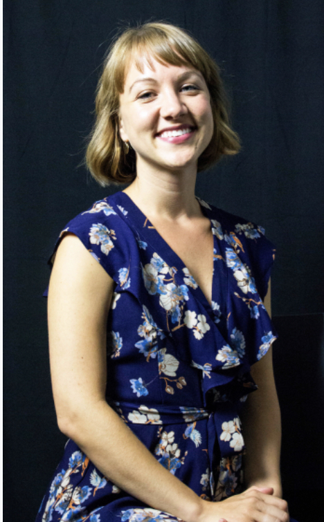
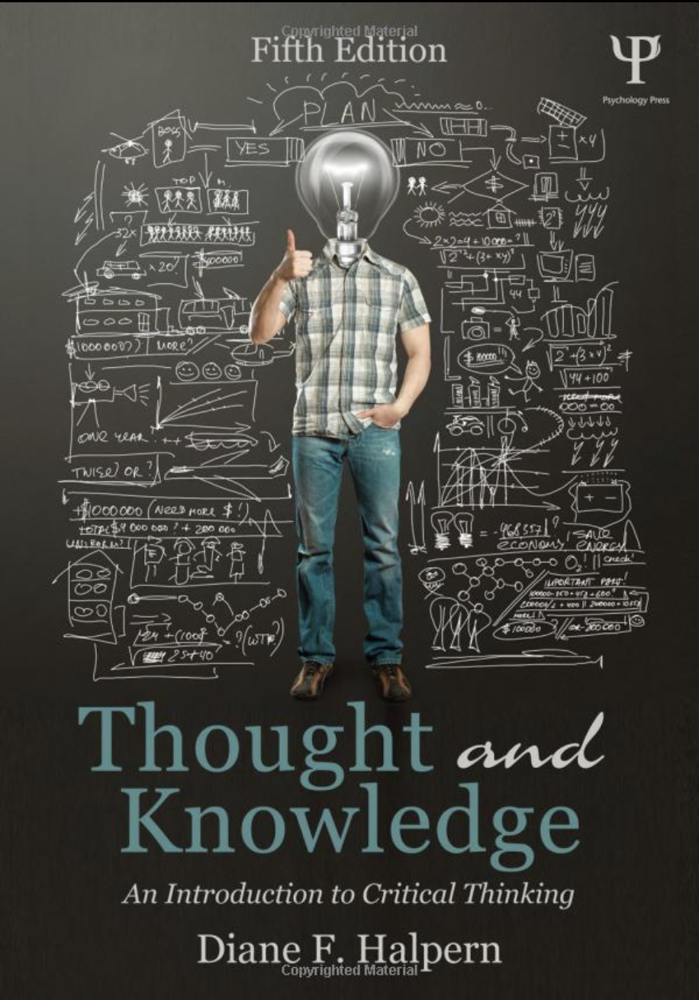

class: title-slide, left, bottom

<font size="50"> EPI 560: Some Preliminaries </font> 

<br><br><br><br><br><br>

**Ashley I Naimi, PhD** <br> Associate Professor <br> Emory University <br>

`r icons::fontawesome("envelope")` &nbsp; ashley.naimi@emory.edu <br> `r icons::fontawesome("github")` &nbsp; ainaimi <br>


```{r startup, include = FALSE, message = FALSE, warning = FALSE}
library(tidyverse)
library(sandwich)
library(lmtest)
library(glue)
library(knitr)

remotes::install_github("hadley/emo")

thm <- theme_classic() +
  theme(
    legend.position = "top",
    legend.background = element_rect(fill = "transparent", colour = NA),
    legend.key = element_rect(fill = "transparent", colour = NA)
  )
theme_set(thm)

options(digits = 3, width = 110)

hexes <- function(x) {
  x <- rev(sort(x))
  bad_svg <- c("dplyr", "tidyr")
  x <- ifelse(x %in% bad_svg, paste0(x, ".png"), paste0(x, ".svg"))
  markup <- function(pkg) glue::glue('')
  res <- purrr::map_chr(x, markup)
  paste0(res, collapse = "")
}
```

---
.font200[

&nbsp;
&nbsp;
&nbsp;

.center[]

]

---

.font150[

* Meet the TAs

* Course Content

* Course Grading

* Some Course Considerations
   - COVID `r emo::ji("sick")`
   - Course Hero `r emo::ji("911")`
   - My Philosophy `r emo::ji("thinking")`
   - How to Learn `r emo::ji("student")`
   - Asking Questions `r emo::ji("raised")`

* R and General Coding Considerations

* Course Logistics

]

---
# Meet the TAs

.pull-left[

Erin

```{r, out.width='50%', fig.align='center', echo=F}

```
]

.pull-right[

Qi (Echo)
```{r, out.width='50%', fig.align='center', echo=F}

```
]

---

# Course Content

Five Sections:

   1. Cohorts and Survival: Cohort and Timescale, Censoring and Truncation, Target Trial Emulation, Risk Functions, Kaplan-Meier Estimator, Competing Risks.
   
   2. Causal Inference: Correlation and Causation; Introduction to Causal Inference; Potential Outcomes; Estimand, Estimator, Estimate; Identifiability.
   
   3. Regression Modeling: Regression Modeling, Marginal versus Conditional Models, Distributions and Link Functions, Inverse Probability Weighting, Marginal Standardization
   
   4. Missing data: MCAR, MAR, MNAR, Multiple Imputation, Inverse Probability Weighting, analysis versus imputation models, relation to causal inference.
   
   5. Variance estimation, model-based standard error, bootstrapping, robust (sandwich) variance estimation.

---
# Course Grading

.font150[

* Section Assignments: 40%

* Analysis (Take Home) Project: 30%

* Final (Take Home) Exam: 30%

]

---
# Course Considerations

.font150[

&nbsp;
&nbsp;
&nbsp;

.center[]

]


---
# Course Considerations

.font150[

COVID, Influenza A, Influenza B, Respiratory Synctial Virus

--

If you are sick, please stay home.

]

---
# Course Considerations

.font150[

Course Hero

--

The RSPH Honor Code states: "Plagiarism is the act of presenting as one’s own work the expression, words, or ideas of another person whether published or unpublished (including the work of another student). A writer’s work should be regarded as his/her own property."

]

---

# Course Considerations: My Teaching Philosophy


&nbsp;
&nbsp;
&nbsp;

.center[]

---
# Course Considerations: My Teaching Philosophy

.font150[* My goal: discourage adversarialism and foster mutualism in the classroom.]

--

.font150[

* My goal: promote a non-judgemental environment in which students comfortably **reveal their** strengths and **limitations**.
   * Have you ever thought about different types of questions you can ask?: [A Typology of Questions](http://www.phy.ilstu.edu/pte/311content/questioning/typology.html)

]

--

.font150[* My view: don't just read. *Understand!*
   * You should really consider watching this [video](https://www.youtube.com/watch?v=3un_VbXVefk)
]

--

.font150[* Your goal: quickly and clearly articulate concepts succinctly and precisely, recognize and elaborate on nuances, and proficiently implement technical (coding) procedures in practical settings.
  * Have you watched the [video](https://www.youtube.com/watch?v=3un_VbXVefk) yet?
]

--

.font150[* Major point we will not cover: practical (analytic) dimensions of any rigorous scientific approach cannot be separated from context. *Context matters.*]

---
# Course Considerations: How to Learn

.font150[Generally, there are incredible tools at your disposal that can facilitate learning. Two of my favorites:]

.pull-left[

```{r, out.width='50%', fig.align='center', echo=F}

```
]

.pull-right[

```{r, out.width='50%', fig.align='center', echo=F}

```
]

---
# Course Considerations: How to Learn

.font150[

Much of the course content will be anchored in or associated with *code*.

* use it

* explore it

* break it

* fix it

* re-write it

* improve it

]

---
# R and General Coding Considerations

.pull-left[

Get the most recent version of R. For Windows and MacOS, install one of the *precompiled binary* distributions (i.e., ready-to-run programs) linked at the top of the R Project web page. 

Once R is installed, download and install R Studio, an "Integrated Development Environment" (IDE). It is a front-end program that enables us to use R more efficiently and effectively.


Install the tidyverse and other add-on packages for R. These will enable you to run the code provided in the course.

]

.pull-right[

[https://posit.cloud/](https://posit.cloud/)

&nbsp;
&nbsp;
&nbsp;
&nbsp;
&nbsp;

[https://posit.co/](https://posit.co/)

&nbsp;
&nbsp;
&nbsp;
&nbsp;
&nbsp;

[https://www.tidyverse.org/](https://www.tidyverse.org/)

]

---
# R and General Coding Considerations

To install the tidyverse and other related packages, you need an internet connection and have to run RStudio. Type the lines into R's command prompt, located in the window named "Console." In the code on the side, the $\leftarrow$ is made up of two keystrokes: first < followed by a short dash, -.

The code below should be a good starting point for the course.


```{r, echo=T, eval=F, tidy=T, tidy.opts=list(width.cutoff=80)}

packages <- c("tidyverse","skimr","here","remotes","boot","survival","GGally","gridExtra","rlang","haven","broom","Hmisc","gmm","VGAM","sandwich","lmtest")

install.packages(package, 
                 repos='http://cran.rstudio.com')


```

If you run into trouble ...

  what will you do once you've graduated and you run into trouble?

---
# Course Logistics

.font150[

Email: 

* [ashley.naimi@emory.edu](mailto:ashley.naimi@emory.edu)
* [erin.rogers@emory.edu](mailto:erin.rogers@emory.edu)
* [qi.zhang2@emory.edu](mailto:qi.zhang2@emory.edu)


Join the Slack Channel: [click here](https://join.slack.com/t/slack-65w6000/shared_invite/zt-1mpdfea8l-pNqUInTQZ~a5ohUsy36XHA)

Please use Slack for all relevant class communication/questions. If you would like to ask a question anonymously, use the "/anonymous " argument before your question.

]