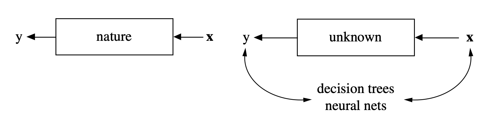

```{r setup, include=FALSE}
library(knitr)
opts_chunk$set(tidy.opts=list(width.cutoff=40),tidy=TRUE)

pacman::p_load(data.table,tidyverse,ggplot2,ggExtra,formatR,
               gridExtra,skimr,here,Hmisc,RColorBrewer,MatchIt)

remotes::install_github("rstudio/fontawesome")

library(fontawesome)

thm <- theme_classic() +
  theme(
    legend.position = "top",
    legend.background = element_rect(fill = "transparent", colour = NA),
    legend.key = element_rect(fill = "transparent", colour = NA)
  )
theme_set(thm)
```

\newpage
\onehalfspacing

# Introduction

# Correlation and Causation

In the *The Grammar of Science,* Karl @Pearson1911 wrote: "[b]eyond such discarded fundamentals as 'matter' and 'force' lies still another fetish amidst the inscrutable arcana of modern science, namely, the category of cause and effect." He suggested that rather than pursue an understanding of cause-effect relations, scientists would be best served by measuring correlations through tables that classify individuals into specific categories. "Such a table is termed a contingency table, and the ultimate scientific statement of description of the relation between two things can always be thrown back upon such a contingency table."

Over a century later, a majority of statistics courses tend to treat causal inference by simply stating that "correlation is not causation." This treatment is hardly sufficient, for at least two reasons: 1) As scientists, our primary interest is (should be) in cause-effect relations; 2) People continue to conflate correlation with causation^[Daniel Westreich and I reviewed a book whose authors were so caught up in the allure of "Big Data", they thoroughly forgot that correlation $\neq$ causation. See @Naimi2014d]. For both of these reasons, we very much need to **clarify the conditions that would allow us to understand causality better.** This is what "causal inference" is all about.

Generally, I adopt the view that **the causal and statistical aspects of a scientific study should be kept as separate as possible.** The objective is to first define the effect and articulate the conditions under which causal inference is possible for this effect, and then to understand what statistical tools will enable us to answer the causal question.^[Loosely speaking: Causal inference is the "what?" Statistics is the "how?" ] Causal inference tells us what we should estimate, and whether we can. Statistics tells us how to estimate it. By implication, we should avoid the commonplace practice of treating statistical models as if they were causal.^[See the section on Inference below] For example, the practice of reading the risk ratio, odds ratio, or risk difference for an exposure of interest from a generalized linear (statistical) model^[or the hazard ratio from a Cox model, or the mean ratio from a Poisson model, or host of other types of regression models] will sometimes work under very specific conditions, but is not the best approach for quantifying exposure effects [@Naimi2020].

# Inference: Statistical and Machine Learning

As scientists and researchers, we encounter the word "inference" quite frequently.
<!-- ^[The etymology of the word infer, from the Latin word *inferre*, means to "bring in"; "in" + "carry, to bear children". For me, the key to this is recognizing that inference requires an act of bringing the truth or falsity of some feature of the outside world within the realm of human understanding.]  -->
Yet it is often used in different ways, and sometimes used to convey different things. This is particularly true if we contrast "inference" in, say, the machine learning literature, to "inference" in statistics. It's hard to see, but practitioners in machine learning disciplines use the word inference in a very different way than those in statistics [@Breiman2001]. 

The key to understanding the difference between what we mean by "inference" in different disciplines in provided in a paper by Galit Shmueli [@Shmueli2010]. In this paper, she distinguishes between two fundamental actions in science: explanation and prediction. 

In simple terms, explanation is the act of building a theoretical model of some aspect of the world we are studying. This model becomes our best representation of how the world works. This is typically a **causal exercise**, in that data are used to understand how variables are causally related to each other.

In contrast, prediction does not involve building theoretical models, or understanding cause-effect relations. The objective is to construct an algorithm that can be used to find any kind of relationship between variables that can be exploited to predict a dependent variable with independent variables. 

```{r breimanfigure, out.width="10cm", fig.align='center', fig.cap="Demonstration of Leo Brieman's 'Data Modeling' and 'Algorithmic Modeling' perspectives. In the Data Modeling approach, scientists use data and statistics to build theoretical models of 'nature', which provides insight about the world. In the Algorithmic Modeling appraoch, scientists are not particularly interested in nature, but moreso in constructing an algorithm that enables us to use $x$ to predict $y$.", echo=F}

```

In algorithmic modeling areas such as machine learning, "inference" is usually meant to to connote a prediction from the algorithm on an out-of-sample observation. Consider, for example to the footnote in Chapter 4 (page 103) of @Murphy2022: "In the deep learning community, the term 'inference' refers to what we will call 'prediction', namely computing $p(y \mid x, \hat{\theta})$." That's typically the extent of what is meant by "inference" in machine learning settings.  

On the other hand, n statistics, "inference" is usually formalized as a measure of the uncertainty that exists between the results that we get in a particular study, and the underlying model of the world (nature in Figure \@ref(fig:breimanfigure)). Statistical inference allows us to provide an answer to the question: how confident should we be that our data support the model?^[There are a lot of subtleties here that we do not have time to discuss. These subtleties have a longstanding history, originating in some of the earliest works in probability theory and statistics (e.g., Jacob Bernoulli's *Ars Conjectandi*, or the *Art of Conjecturing*). I refer the interested reader to the recent book by @Clayton2021, or chapter 4 of the book by @Diaconis2019.] There are several tools available for us to do this, including Frequentist tools focused on error control, and Bayesian tools focused on updating beliefs based on new evidence. However, both share a common goal which is to use data to attempt to quantify how wrong we might be about a statement about how the world works.

# References