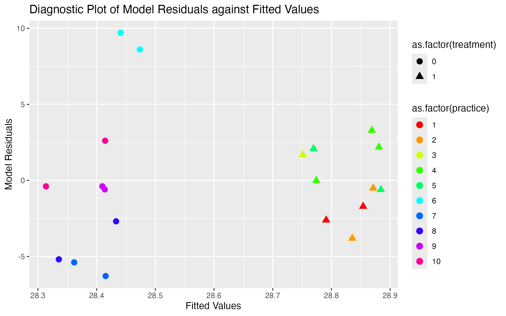

```{r setup, include=FALSE}
packages <- c("data.table","tidyverse","skimr","here",
              "broom","sandwich","RColorBrewer")

for (package in packages) {
  if (!require(package, character.only=T, quietly=T)) {
    install.packages(package, repos='http://lib.stat.cmu.edu/R/CRAN')
  }
}

for (package in packages) {
  library(package, character.only=T)
}

thm <- theme_classic() +
  theme(
    legend.position = "top",
    legend.background = element_rect(fill = "transparent", colour = NA),
    #legend.key = element_rect(fill = "transparent", colour = NA)
  )
theme_set(thm)
```

### Intro

In this document, we explore the robust variance estimator. If I have energy and time, we'll try to dive into it's relation with GEE.

### Some Questions

What, exactly, is the robust variance estimator? How does it differ from the "standard" variance estimator? What are the differences between *different* robust variance estimators (e.g., HC1, HC2, HC3, etc)? Are there differences between robust variance estimators for heteroscedasticity versus clustering? How do these relate to variance estimators from generalized estimating equations?

We'll try to answer these here.

### Understanding Model-Based SEs

To start, we'll work with linear models in a simple setting. Continuous outcome with a binary treatment. 

```{r,message=F,warning=F}
bmi_data <- read_csv(here("data","cluster_trial_data.csv"))

bmi_data %>% print(n=5)
```

Consider the standard ordinary least squares regression model, with $y$ being BMI and $X$ being the treatment indicator:

$$ E(y \mid X) = \beta_0 + \beta_1X$$
The point estimates for this model can be obtained using the standard OLS estimator:

$$ \mathbf{\hat{\beta}} = (X^{\intercal}X)^{-1}X^{\intercal}y $$
With the cluster_trial data, we get this:

```{r}

X <- cbind(1,bmi_data$treatment)

y <- bmi_data$BMI

beta_hat <- solve(t(X)%*%X)%*%t(X)%*%y

beta_hat

```

(note how they exactly match the estimates from the `lm()` output)

```{r}

mod <- lm(BMI~treatment,data=bmi_data)

mod

```

Once the parameter estimates are obtained, next step is to estimate their standard errors. The equation to obtain standard errors for the parameter estimates is:

$$ V(\hat{\beta}) = (X^{\intercal}X)^{-1} X^{\intercal} \Sigma X (X^{\intercal}X)^{-1} $$
This equation has two important pieces:

1. $(X^{\intercal}X)^{-1}$
2. $X^{\intercal} \Sigma X$

Because the second piece is "sandwiched" between the first, this formula is often called the sandwich variance estimator. 

The first piece is the inverse of the matrix multiplication of the design matrix. In the cluster trial data, the design matrix is a column of 1s (for the intercept), and a column representing the treatment variable.

The second piece has two components. The first is the variance matrix $\Sigma$, which is a square matrix with the variance of the residuals on the diagonal:

```{r}

s <- sum((y - X%*%beta_hat)^2)/(nrow(bmi_data) - 2) ## note: deviance generalizes residual sum 
                                                     ## of squares for GLM
s

Sigma <- s*diag(nrow(bmi_data)) ## this is the key ingredient in the "meat"

```

Basically, $\Sigma$ (`Sigma`) is a $20\times 20$ matrix (recall, there are 20 observations in the data) with `r s` on the diagonal and zeros everywhere else. This diagonal value is obtained as the sum of the squared model residuals divided by the degrees of freedom, and represents the "variation" in the model. More generally (i.e., when a GLM is used with a nonlinear link function), the diagonal value can be obtained using the deviance statistic.

So the second piece is obtained by taking this model variation, and translating it into the parameter space. In other words, the second piece is taking the model variation and "transforming" it so that it is represented as uncertainty in the parameter estimates.^[More technically (linear algebra!), $\Sigma$ undergoes a basis change from $\mathbb{R}^N$ to $\mathbb{R}^p$, where $N$ is the sample size and $p$ is the number of parameters.]

Putting each piece together, we have:

```{r}

var_beta <- solve(t(X)%*%X)%*%(t(X)%*%Sigma%*%X)%*%solve(t(X)%*%X) # recall: for a square matrix t(X)%*%X, solve() returns the inverse

var_beta

```

The diagonal of `var_beta` is the variance of the parameter estimates (its square root thus the standard error), while the off-diagonal represents the covariance between the parameter estimates. Note, again, how this variance covariance matrix `var_beta` is identical to the model output:

```{r}

vcov(mod)

```


Importantly, for this model-based SE, the variance on the diagonal of $\Sigma$ is the same for each person in the data: `r s`. This is reflective of one of the central assumptions underlying the model: in the OLS case, homoscedasticity. Alternatively, if we were to use a generalized linear model with a Gaussian distribution and identity link (a mathematically equivalent approach), this assumption is captured as "constant variance", which is the $\sigma^2$ we would use to parameterize the Gaussian distribution used in the model.

This homoscedasticity or constant variance assumption may not be correct or ideal, and is precisely what the robust variance estimator is meant to address.

### Understanding Robust Variance SEs

One of the main problems with the above variance estimator is that it assumes the data for each observation is generated from a Gaussian distribution, **with the same variance for each** (constant variance). Let's explore this assumption. 

```{r,message=F,warning=F}

plot1 <- augment(mod) %>% mutate(practice=bmi_data$practice) %>% 
  ggplot(.) +
  geom_point(aes(x=jitter(.fitted),
                 y=.resid,
                 color=as.factor(practice),
                 shape=as.factor(treatment)),
             size=3) +
  ylab("Model Residuals") + xlab("Fitted Values") +
  scale_color_manual(values=rainbow(10)) +
  ggtitle("Diagnostic Plot of Model Residuals against Fitted Values")

ggsave("./diagnostic.pdf",width=8,height=5)
ggsave("./diagnostic.png",width=8,height=5)


```

This figure is a basic diagnostic plot, showing how the residuals of the model are spread as a function of the model's fitted values. In this case, we only have two fitted values (jittered for demonstration) because the model has only one binary treatment variable.

```{r, out.width = "600px",echo=F}

```

This plot shows a few important things. First, and most importantly, the spread of the residuals on the $y$-axis is far larger for lower fitted values than for higher fitted values. Second, This difference in spread is perfectly correlated with treatment (circles, or untreated, are spread out more than triangles, or treated), and also correlated with practice: practices 6, 7, 8, 9 and 10 have more spread than the first five. This make sense, since this was a cluster randomized trial and the first five practices were treated and the remaining were placebo.

These problems are a good example of heteroscedasticity, or a violation of the "constant variance" assumption. Untreated practices seem to have a higher variance than treated ones. Because of this, the homoscedastic (or constant variance) error assumption mentioned above may not be the best way to analyse these data. That is, the value of `r s` on the diagonal of the $\Sigma$ matrix may be too small for untreated practices, and too large for treated practices. This would generally lead to problems with inference--that is, standard errors that do not yield confidence intervals with nominal coverage, or inferential tests with incorrect error rates.

This is why robust variance estimators were developed. Several exist. We will start with the HC1 estimator^[note "HC" stands for heteroscedastic consistent]

The HC1 estimator essentially uses the squared residuals in `s` as above, but instead of summing over them, it leaves them at their original (i.e., unsummed) values. So, while the diagonal of the $\Sigma$ matrix in the variance equation above was set to `r s` for all 20 observations in the sample, the HC1 estimator will simply use each individuals' residual, without summing over them:

```{r}

s_hc1 <- ((y - X%*%beta_hat)^2)*(nrow(bmi_data) / (nrow(bmi_data) - 2)) ## note: no sum

round(s_hc1,2)

```

The largest value in this list of individual-level variances is `r max(round(s_hc1,2))`, which is much larger than it's lowest value, basically `r min(round(s_hc1,2))`, again suggesting that constant variance is probably not a good assumption.

To implement the HC1 variance estimator, we simply replace the diagonals of `r s` for each person with these diagonals of individual-level residuals multiplied by the degrees of freedom for the HC1 estimator (in this case, $N/(N-p)$). We can then use the same equation for the variance, but this time with the new $\Sigma_{HC1}$:

```{r}
Sigma_HC1 <- diag(nrow(bmi_data))
diag(Sigma_HC1) <- s_hc1

## meatHC(mod,type="HC1") = (t(X)%*%Sigma_HC1%*%X)/20

var_beta_hc1 <- solve(t(X)%*%X)%*%(t(X)%*%Sigma_HC1%*%X)%*%solve(t(X)%*%X) # recall: for a square matrix t(X)%*%X, solve() returns the inverse

var_beta_hc1
```

The diagonal of `var_beta_hc1` is the HC1 version of the robust variance of the parameter estimates (its square root thus the standard error), while the off-diagonal represents the corresponding covariance between the parameter estimates. Note, again, how this variance covariance matrix `var_beta_hc1` is identical to the output we would get if we used the robust variance estimator in R from the sandwich package:

```{r}

vcovHC(mod,type="HC1")

```

What about different variations of the HC variance estimators? There are many types programmed in R, including "HC3" (the default), "const", "HC", "HC0", "HC1", "HC2", "HC4", "HC4m", and "HC5". 

The default version replaces the HC1 variance obtained from the scaled residuals for each observation with: 

$$ \frac{\hat{u}_i^2}{(1 - h_i)^2} $$

where $\hat{u}_i$ are the estimated residuals from the model, in our case `(y - X%*%beta_hat)^2`, and where $h_i$ are the leverage points for each observation obtained from the model. 

Leverage values are obtained as the diagonal entries of the hat matrix, defined as: 

$$ \mathbf{H} = X(X^{\intercal}X)^{-1}X^{\intercal}. $$

This hat matrix measures ... . In R, these leverage values can be calculated easily with our design matrix as:

```{r}

H <- X%*%solve(t(X)%*%X)%*%t(X)

h <- diag(H)

h

```

which match exactly the leverage values obtained from the fitted model:

```{r}
hatvalues(mod)
```

With these, we can then compute the diagonal of $\Sigma$ for the HC3 (default) estimator:

```{r}

s_hc3 <- ((y - X%*%beta_hat)^2)/((1-h)^2)

Sigma_HC3 <- diag(nrow(bmi_data))
diag(Sigma_HC3) <- s_hc3

var_beta_hc3 <- solve(t(X)%*%X)%*%(t(X)%*%Sigma_HC3%*%X)%*%solve(t(X)%*%X) # recall: for a square matrix t(X)%*%X, solve() returns the inverse

var_beta_hc3

```

Once again, this variance covariance matrix `var_beta_hc3` is identical to the output for HC3 in R:

```{r}

vcovHC(mod,type="HC3")

```

### Cluster Robust SE

```{r}

vcovCL(mod,cluster=bmi_data$practice,type="HC1",sandwich=T)

## bread(mod)/20 = solve(t(X)%*%X)

meatCL(mod,cluster=bmi_data$practice,type="HC1")


(t(X)%*%Sigma_HC1%*%X)

(t(X)%*%Sigma_HC1%*%X)/meatCL(mod,cluster=bmi_data$practice,type="HC1")


```


```{r}
s_hc1 <- ((y - X%*%beta_hat)^2)*(nrow(bmi_data) / (nrow(bmi_data) - 2)) ## note: no sum

round(s_hc1,2)

Sigma_HC1 <- diag(nrow(bmi_data))
diag(Sigma_HC1) <- s_hc1

var_beta_hc1 <- solve(t(X)%*%X)%*%(t(X)%*%Sigma_HC1%*%X)%*%solve(t(X)%*%X) # recall: for a square matrix t(X)%*%X, solve() returns the inverse

var_beta_hc1
```