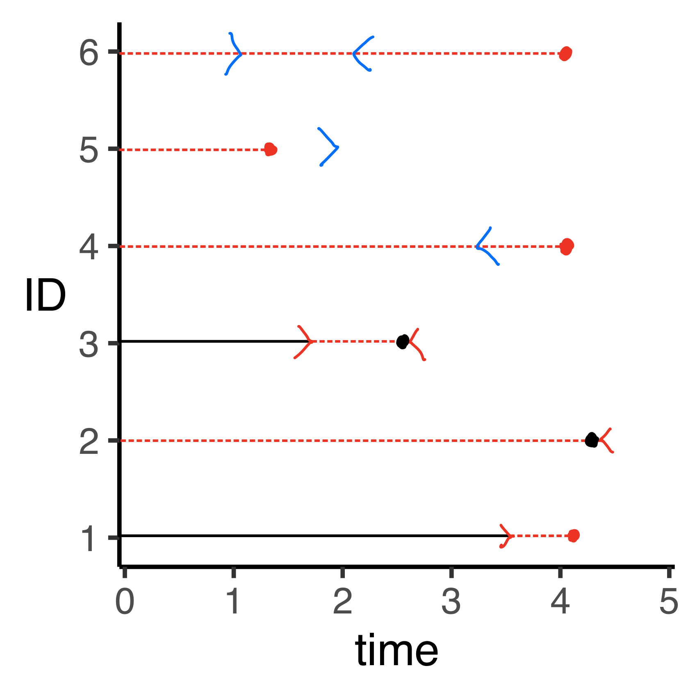

 
```{r setup, include=FALSE}
knitr::opts_chunk$set(echo = TRUE)

packages <- c( "data.table","tidyverse","ggplot2","ggExtra",
               "gridExtra","skimr","here","Hmisc","RColorBrewer")

for (package in packages) {
  if (!require(package, character.only=T, quietly=T)) {
    install.packages(package, repos='http://lib.stat.cmu.edu/R/CRAN')
  }
}

for (package in packages) {
  library(package, character.only=T)
}

remotes::install_github("rstudio/fontawesome")

library(fontawesome)

thm <- theme_classic() +
  theme(
    legend.position = "top",
    legend.background = element_rect(fill = "transparent", colour = NA),
    legend.key = element_rect(fill = "transparent", colour = NA)
  )
theme_set(thm)
```

\newpage
\noindent {\Large \bf Outline}
\vskip .25cm
\noindent \underline{Survival Analysis Basics}
\begin{itemize}
  \item Cohort and Timescale
  \item Risk (Functions)
  \item Risk with Censoring
  \item Risk with Competing Events
  \item Risk with Truncation
  \item
  \item (save for week 2)
  \item Risk with Treatment (Counterfactuals)
  \item Causal Inference
  \item Target Trials
\end{itemize}

\newpage
\onehalfspacing

# Cohort and Timescale

Most of the tools we use in epidemiology are either defined, or are demonstrably valid, only based upon the presence or absence of certain fundamentals or some foundation. The idea of a cohort, and a well defined timescale are two pillars of this foundation.

For example, you should already know about how a case-control odds ratio can be used to estimate a *cohort* risk ratio, rate ratio, or odds ratio, depending on how the controls are sampled from the original cohort. That is, the interpretation of a case-control odds ratio depends on details emanating from the cohort we have.^[Specifically, a case-control odds ratio quantifies a cohort risk ratio, rate ratio, and odds ratio when we use base-case sampling, incidence density sampling, and cumulative sampling, respectively.]

Alternatively, the fact that we can interpret a parameter estimate for an exposure of interest from, say, a logistic regression model as a ratio of two odds also depends on the fact that we've collected data on a *cohort* with a well-defined start and stop time. Without this underlying concept of a cohort with well-defined start and stop times, all we get from logistic models are values of a parameter which maximize the likelihood function, which is not the same as an odds or risk ratio.^[Consider a fictional "Frankenstein" cohort of 600 men and 400 women, with 250 women aged 15-25, and the rest between 55-64 years. A subset of the cohort is recruited between 1910-1955, with the rest recruited between 2000-2010. We define an outcome indicator to be 1 if the individual experienced ovarian cancer, 0 otherwise. If we fit a logistic model regressing this outcome against, say, race and BMI, can we say that we are modeling the **risk** of ovarian cancer? No.]

In epidemiologic settings, a cohort is simply a group of people. Ideally, we would like to use a particular cohort to better understand features of the population from which this cohort was sampled.^[**generalizability** \\ **selection bias**] Cohorts can be either closed (people do not enter or leave the cohort during the study), or open (people are free to enter or leave the study at any time). In epidemiology (and particularly in this course) we deal mostly (exclusively) with closed cohorts. 

To completely define a cohort, we need to clearly define a start or origin time, and a stop time. In the case of a closed cohort, without a well defined start and stop time, we would not be able to decisively state whether a given person should be in or has left the cohort. Consider the following diagram:

```{r, warning=F, message=F, echo=F, include=F}

cohort <- read_csv("../data/example_dat1.csv")

cohort %>% 
  filter(ID<=10) %>%
  mutate(ID=rank(time,ties="random"),
         outcome=if_else(time<5,1,0)) %>% 
  ggplot(.) + 
  geom_linerange(aes(y=ID,xmin=start,xmax=time)) +
  geom_point(aes(y=ID,x=time,shape=factor(outcome))) +
  scale_y_continuous(expand=c(0.05,0.05), 
                     breaks=seq(1,10,1)) +
  scale_x_continuous(expand=c(0,0.05)) +
  scale_shape_discrete(name = "Outcome") +
  theme(axis.title.y = element_text(angle=0,vjust=.5))


ggsave("../figures/2021_08_19-figure1.png")

```

```{r tenobs, out.width = "300px", fig.align='center', fig.cap="Observed data from a hypothetical study of 10 observations. Data are from a closed cohort with a common start time (time=0) and up to 5 time-points (e.g., weeks, months, years) of follow-up.",echo=F}
knitr::include_graphics("../figures/2021_08_19-figure1.png")
```

Figure \@ref(fig:tenobs) shows ten simulated observations. Assume for the moment that the outcomes for these observations are as follows: 0 = no outcome; 1 = event of interest. In this setting, time zero is our start time. The start time usually corresponds to some well-defined event such as an age of interest (age as time-scale), a date of interest (calendar date as time-scale), or the timing of some important study marker (e.g., date of randomization to treatment versus placebo).^[**incident** versus **prevalent** cohort]

Consider the following examples from the literature with different study time-scales:

1) ^!^Naimi2021 use data from a randomized trial to estimate the adherence adjusted per protocol effect of daily low-dose aspirin on pregnancy outcomes in ~1,200 women. In this study, the timescale was **weeks since randomization**, and ranged from 0 to 60 weeks.

2) ^!^Getahun2005 examined stillbirth, small for gestational age, and infant mortality occurrence by the racial classification of both parents (e.g., white-white, white-black, black-white, black-black) in roughly 20 million pregnancies in the United States. In this study, the timescale was **gestational age**, starting at the 20th week of gestation.

3) ^!^Huang2018 looked at the relation between different post-operative management strategies, including the use of dexamethasone versus flurbiprofen axetil on survival in 588 patients undergoing surgical lung resection for non-small-cell lung cancer. In this study, the timescale was **time since surgical resection**.

4) ^!^Schwarzinger2018 looked at the relation between alcohol use and dementia risk in nearly 31 million individuals in France between 2008 and 2013. In this analysis, the timescale was age, meaning that "time 0" was the age at which the individual entered into the study, corresponding to the age at the calendar date during which the study started.

```{r censtrunc, out.width = "150px", fig.margin=TRUE, fig.cap="Six observations in a hypothetical study depicting censoring and truncation (left, right, and interval for both).",echo=F}

```

5) ^!^Sabia2019 looked at the association between cardiovascular health at age 50 and the risk of subsequent dementia in ~8,000 individuals enrolled in the Whitehall II study. In this analysis, the timescale was **calendar date**, with the starting date being the date of clinical examination at age 50.

# Censoring and Truncation

Figure \@ref(fig:tenobs) is an important tool, and we will make much use of it. However, for now, we will generalize this figure to depict two key concepts: **censoring** and **truncation**. These concepts are illustrated in Figure \@ref(fig:censtrunc), showing a line diagram corresponding to Figure \@ref(fig:tenobs), but with six distinct scenarios.

The first three observations in Figure \@ref(fig:censtrunc) depict right, left, and interval censoring, respectively. The last three observations depict right, left, and interval truncation.^[Note that interval censoring and interval truncation are often referred to as double censoring and double truncation.]

**Right Censoring** (ID = 1 in Figure \@ref(fig:censtrunc)): occurs when an individual is enrolled in the study, but we don't know whether the individual has had an event of interest or not. This type of censoring often occurs because either an enrolled individual leaves the study (withdrawal), or the study ends (administrative censoring). This is often said to be the most common type of censoring. Generally, when we use the word "censoring" in this class, we are referring to right censoring.

**Left Censoring** (ID = 2 in Figure \@ref(fig:censtrunc)): occurs when an individual is enrolled in the study, and we know has experienced an event of interest (and we know which event it is), but we have no information on *when* the event occurred. I believe this to be the most common type of censoring, due to the fact that most often, we collect data on whether an event occurred or not during the course of our study, and not on the exact timing of events. Thus, outcomes in a typical cohort study that do not have information on the timing of events are left censored.

**Interval Censoring** (ID = 3 in Figure \@ref(fig:censtrunc)): occurs when an individual is enrolled in the study, and we know has experienced an event of interest (and we know which event it is), but we only know that the event occurred in a bounded *interval*, with the bounds occurring after the study start date and before the study end date.

\begin{fullwidth}
\hrulefill

\noindent \textsc{Context Note:} In survival (a.k.a. time-to-event) analysis, survival time is typically classified as either {\bf continuous} or {\bf discrete} time. Simply put, in a continuous time setting, the time to the events of interest are positive real numbers ($\mathbb{R}^+$), or a quantity that can be represented as an infinite decimal expansion. In contrast, in a discrete time setting, the time to the events of interest are typically positive integer values ($\mathbb{Z}^+$), or a whole non-decimal number. In survival analysis \emph{theory}, there are important distinctions between continuous and discrete time analyses. These distinctions are much less important for practical analyses of time-to-event data. For example, in a continuous time setting, one might have interval-censored data, since the exact timing of the event of interest might not be known. However, if the timescale of an analysis is (e.g.) week on study, and we know that the event happened in week $J$, this is typically enough for a discrete time analysis, and we would not have to censor the outcome.

\noindent \hrulefill
\end{fullwidth}

**Right Truncation** (ID = 4 in Figure \@ref(fig:censtrunc)): occurs when an individual is NOT enrolled in the study because the event happened after a particular date. One example is in ^!^Medley1987, who studied time from exposure to HIV contaminated blood or blood products and the development of AIDS. Data were collected retrospectively from individuals with confirmed AIDS diagnosis. The number of individuals who were exposed to HIV contaminated blood or blood products that had not yet developed AIDS was not known. In this study, only those individuals who developed AIDS by the time the study was enrolling could be identified for inclusion, which resulted in right truncated data.

\begin{fullwidth}
\hrulefill

\noindent \textsc{Study Note:} You may have encountered various definitions of "retrospective" and "prospective" cohorts: retrospective = case-control, prospective = cohort; the investigator's perspective; and the exposure record in relation to the outcome. You may have also heard that retrospective studies are generally lower quality than prospective studies, with a range of reasons as to why. Two fundamental questions are: which of these study designs is more prone to left, right, and interval truncation?; How do the ideas of truncation and censoring relate to the quality of retrospective versus prospective studies?

\noindent \hrulefill
\end{fullwidth}

**Left Truncation** (ID = 5 in Figure \@ref(fig:censtrunc)): occurs when an individual is NOT enrolled in the study because the event happened before a particular date. This type of truncation is common in studies of spontaneous abortion. For example, ^!^Waller1998 examined the relation between prenatal exposure to trihalomethanes in drinking water (a by product of chlorination) and spontaneous abortion. Women were recruited from prenatal care clinics. However, spontaneous abortion tends to be more common early in pregnancy (and can often be confused with normal menstruation). Thus, it is likely that many spontaneous abortions were missed because they occurred before enrollment began, resulting in left truncated data.

**Interval Truncation** (ID = 6 in Figure \@ref(fig:censtrunc)): occurs when an individual is NOT enrolled in the study because the event happened between two dates. Interval truncation occurs in studies of, for example, autopsy confirmed neurodegenerative diseases (ND). On the one hand, diagnosing ND is difficult, and studies tend to focus on the occurrence of disease in older populations. Thus, individuals who experience ND early tend not to be included in these studies. On the other hand, because autopsy confirmation is required for inclusion in the study, individuals who survive past the study start date are also not included. This example, as well as methods to address interval truncation, are discussed in ^!^Rennert2018. 

There are some important takeaways from these definitions and examples: 

First, with censoring, the individuals are included in our study but we do not see when their events occur. With truncation, we do not see the individuals, and thus cannot include them in our study.^[Linguistically, we say that *individuals* are censored, but *data* are truncated.]

Second, it's important to connect the idea of censoring and truncation back to the idea of cohort and timescale, and our ability to validly interpret regression model parameters as risk differences, risk ratios, or odds ratios.^[Note that validity here depends on more than just the presence or absence of censoring and truncation. But appropriate handling of censoring and truncation are essential (i.e., necessary, but not sufficient).] Clearly, censoring and truncation matter because they determine whose outcome is observed or who is in cohort. Without carefully considering how to handle censored or truncated data, we can obtain biased (i.e., inconsistent) results.

# Risk (Functions)

Let's say we did a study of the effect of some exposure on an outcome of interest, which yielded the following dataset:

\

```{r synthdat, echo=F, results="asis"}

cohort %>% 
  filter(ID<=10) %>%
  mutate(ID=rank(time,ties="random"),
         exposure=X,
         confounder=L,
         start_time=start,
         stop_time=time,
         outcome=if_else(time<5,1,0)) %>% 
  arrange(ID) %>% 
  select(ID, exposure, confounder, start_time, stop_time, outcome) %>% 
  knitr::kable(., caption="Synthetic Data", digits = 2)
```

\

These are the same data displayed in Figure \@ref(fig:tenobs).

We are going to focus here on risk. Risk is a central parameter in cohort studies [^!^Cole2015], and is often specified as the "probability of an event during a specified period of time." [^!^Rothman2008]^[It's useful to separate the linguistic connotations of the word "risk" from its mathematical definition, which can sometimes lead to confusion. For example, one might define the "risk of live birth". Linguistically, "risk" connotes something bad, whereas in many cases successful live birth is a good thing. Here, we will be using the word "risk" in its strictly mathematical sense. In practice, I will often use "probability" instead of risk to avoid this potential dissonance.] For now, let's evaluate the risk without looking at the role that the exposure plays in influencing the outcome. This is akin to a "no intervention" or "no treatment" scenario, by which we mean that we want to compute the risk of the outcome that we actually observed--i.e., the risk under the natural settings in the study. Importantly, this is **not** the risk if everyone's exposure were set to zero. It's the risk that would be observed if we did nothing. This is sometimes referred to as the **natural course** risk [^!^Rudolph2021].

\begin{fullwidth}
\hrulefill

\noindent \textsc{Context Note:} Often when we use the word "bias" in epidemiology, we actually mean "inconsistent" in the statistical sense. Technically, an estimator $\hat{\theta}$ is consistent if, for some arbitrarily small $\epsilon > 0$: $$\lim_{n \rightarrow \infty} P( | \hat{\theta} - \theta | > \epsilon ) = 0.$$ When epidemiologic bias is present (confounding, selection, information), the estimator will not converge to the truth no matter how large a sample we have. In contrast, we say that an estimator is biased (in finite samples) if: $$E(\hat{\theta} - \theta) \neq 0.$$ That is, we can have zero confounding (i.e., a consistent estimator), but still have a biased estimator because of how poorly it performs at using the data to estimate the effect at a given sample size. One example of this is the partial likelihood estimator used to quantify parameters of a Cox regression model (see Johnson1982). Usually, this statistical bias will disappear as the sample size increases.

\noindent \hrulefill
\end{fullwidth}

Mathematically, we define the risk of an outcome as 

$$ F(t) = P(T \leq t) $$

This equation quantifies the probability (or risk) that the observed failure time $T$ is less than or equal to some arbitrary threshold $t$. 

Relatedly, we could define survival as:

$$S(t) = 1 - F(t) = P(T>t)$$

The risk and survival functions are complements to one another. Both equations are a compact way of asking how the risk cumulates over time: For example, if we have a study with 5 years of follow-up, with years as the time-scale,^[In order for this equation to make sense, we need a follow-up time and a time-scale.] the risk equation can be framed as: the probability that event happens before or at: $t \leq$ 1 year, or $t \leq$ 2 years, or $t \leq$ 3 years, or $t \leq$ 4 years, or $t \leq$ 5 years.

To compute this, we can simply calculate the average number of events in the first, second, third, fourth, and fifth years on study.^[This only works if there is only a single event type and no censoring.] The denominator for this risk is everyone in the sample. For example, using the ten observations from the synthetic data in Table \@ref(tab:synthdat), we have:^[Make sure you understand how these risks are calculated from the Table.]

\begin{align*}
\text{Year 1: } & \sfrac{4}{10} = .4 \\
\text{Year 2: } & \sfrac{4}{10} + \sfrac{0}{10} = .4 \\
\text{Year 3: } & \sfrac{4}{10} + \sfrac{0}{10} + \sfrac{2}{10} = .6 \\
\text{Year 4: } & \sfrac{4}{10} + \sfrac{0}{10} + \sfrac{2}{10} + \sfrac{1}{10} = .7 \\
\text{Year 5: } & \sfrac{4}{10} + \sfrac{0}{10} + \sfrac{2}{10} + \sfrac{1}{10} + \sfrac{0}{10} = .7 \\
\end{align*}


\newpage

# References